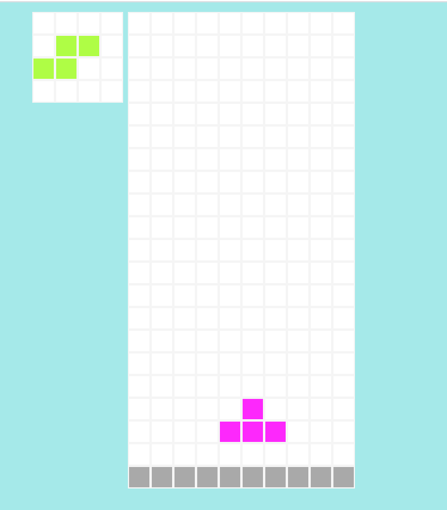

## You can play it here: 
<h3><st> You can play it <a href="https://sawamotokai.github.io/tetris/">here</a> </st></h3>

## How to play
* Hit space key to start
* Navigate tetrominoes with arrow keys ←→↓
* Rotate tetrominoes with ↑
* Refresh the page to play the game again
* What is your high score?

## How I built it
* HTML
  - I defined a grid, blocks in side the grid, the window for the next block

* JavaScript
  - I used setInterval so it renders a new state each second
  - Based on the current position of the block and its next rotated state, it decides whether it's rotatable at that position
  - Give different class name based on whether the block is moving down, sit on the floor and changed their class depending on the situation
  - After each render, check whether there are any rows deletable and delete if necessary, while pushing down block above by the number of rows deleted
  - Accumulate score based on the number of rows deleted at the same time (this abides by the official tetris' rule)
  - As scores exceeds thresholds, speed up the rendering interval

* CSS
  - Using flex box, aligned each squares inside the grid
  - Defined the colors for each shape and state of blocks

## How I deployed it
* This is deployed on github pages since it's a satatic website
